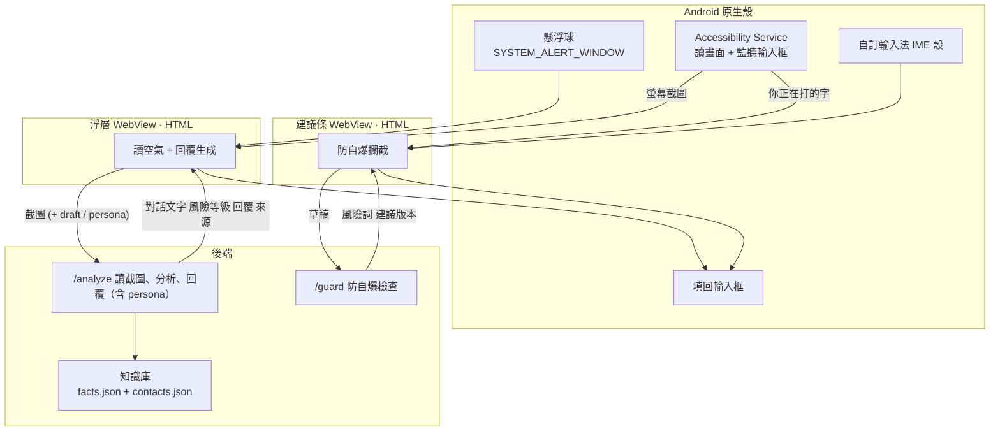

# Spec

FUTUREMODE × SITCON BUILDMODE Hackathon 2026｜賽道 Future of Work

**這份 spec 的上游是 [demo-script.md](demo-script.md)。** 功能如果沒出現在 demo 腳本裡，就不是這次的優先項。

---

## 定案

| 項目 | 決定 | 決定時間 |
|---|---|---|
| 平台 | **Android** | 2026-08-31 |
| **介面形態** | **兩個 surface：浮層卡片 ＋ 鍵盤上方建議條** | 2026-08-31 |
| UI 技術 | **純 HTML + CSS，跑在 WebView 裡** | 2026-08-31 |
| 知識庫 | **事實庫 ＋ 對象檔案** | 2026-08-31 |
| 角色改寫 | **三張角色卡（諸葛亮／霸道總裁／情場達人），改寫已生成的回覆；上台版演諸葛亮、影片只閃過、情場達人不進 demo**。契約見 prompts/README-組裝說明.md 的 /persona 段 | 2026-09-02 |
| 知識庫餵入 | **做最小可行版：貼文字或連結 → AI 抽成條目草稿 → 使用者確認才寫入。收文字與連結（連結抓不到就請使用者貼文字，不編）。不做編輯／刪除 UI（CRUD API 已存在，這次不接）。上台不加演，只當 QA 彈藥。** 契約見 prompts/README-組裝說明.md 的 /extract 段 | 2026-09-03 |
| **輸入形式** | **改為截圖（base64）**，不再傳對話文字陣列。AI 讀圖後回傳 `conversationText` 給後端比對 golden path | 2026-09-03 |
| **分流與安全牌** | **砍掉整個功能**——不做本地規則、沒有 0.2 秒安全牌。demo 秒數靠剪輯處理 | 2026-09-03 |
| **角色改寫呼叫方式** | **併進 `/analyze` 的 `persona` 參數**（一次呼叫直接產角色版）。`/persona` 端點保留但 demo 不用 | 2026-09-03 |
| 知識庫租戶 | **不做使用者系統，全域單一知識庫、所有人共用**。QA 被問到照實說 | 2026-09-03 |
| 多知識庫／專案切換 | **不做**。demo 設定為「只討論同一個專案」 | 2026-09-03 |
| 知識庫檢索 | **維持後端粗篩**（tags/label 關鍵字）。截圖模式下先塞全部事實（量小），不改成 AI 猜關鍵字的兩段式 | 2026-09-03 |
| 雲端硬碟授權（Google Drive） | **不做**，Brian 自建資料庫。列為產品化路線圖，QA 可提 | 2026-09-03 |

### 為什麼是兩個 surface

各司其職，而且 demo 的兩幕正好各佔一個：

| Surface | 負責 | Demo |
|---|---|---|
| **浮層卡片** | 讀懂對話、產生回覆 | 第一幕（讀空氣） |
| **鍵盤建議條** | 攔截使用者自己打的字 | 第二幕（防自爆） |

**注意兩件技術事實**：

1. **鍵盤讀不到對方的訊息。** Android IME 跟 iOS 一樣，只能存取使用者正在輸入的欄位。所以「讀懂對話」一定要靠 Accessibility Service，鍵盤不能取代它。
2. **Accessibility Service 也監聽得到輸入框的文字變化**（`TYPE_VIEW_TEXT_CHANGED`）。所以防自爆的「偵測」可以由它做，鍵盤負責的是「呈現建議」這個介面。

### 為什麼是原生殼 + WebView

Android 原生 UI 是 Compose／XML，吃不了 HTML。如果視覺稿要被原生重刻一次，等於做兩次。

所以架構切成兩層：

- **Android 原生**只負責它非做不可的事：懸浮球、螢幕權限、讀畫面、IME 殼、填回輸入框
- **WebView 裡的 HTML** 就是產品的 UI 本體

兩個 surface 都用 WebView：浮層是一個 WebView，IME 的建議條也是一個 WebView（Android IME 的 input view 可以是任意 View）。

---

## 架構

> v0.2（2026-09-03 三人討論定案）：分流與安全牌整個功能砍掉、輸入改截圖。
> 下面的圖與機制說明已對齊這次改動——見決策表。



---

## 兩個機制

分流與安全牌已砍掉（見決策表）：不再有本地規則預先給答案，demo 的節奏靠剪輯處理，不靠 0.2 秒安全牌。

### 1. 讀空氣

在產生回覆**之前**先判斷氣氛。

輸出三個等級：

| 等級 | 情境 | 策略 |
|---|---|---|
| `safe` | 一般往來 | 正常回覆 |
| `pressure` | 對方在催、在質疑、帶情緒 | **強制切換成「安撫 ＋ 給承諾」**，禁止只回「收到」 |
| `sensitive` | 涉及金額、承諾、責任歸屬 | 加上來源標註，措辭保守 |

**這是產品跟一般聊天機器人的分界線。** 一般 AI 只判斷「這句話怎麼回」，我們判斷「現在能不能這樣回」。

### 2. 防自爆

使用者不採用建議、自己動手打字時觸發。

偵測三類訊號：**防禦**（「我們跟別人不一樣」）、**推卸**（「那是他們那邊的問題」）、**火氣**（情緒詞、驚嘆號密度）。

命中就跳出潤飾建議，不強制取代。

---

## API 介面

前後端可以並行開發，靠這份契約對齊。

### `POST /analyze`

讀一張截圖，回傳讀到的對話文字、風險等級與建議回覆。**v0.2：persona 併入本端點**，帶了就直接產角色版回覆；`draft` 帶了就是「改寫使用者的草稿」而不是「產生回覆」。完整組裝契約見 `prompts/README-組裝說明.md`。

**Request**

```json
{
  "screenshot": "data:image/png;base64,...",
  "draft": "（選填）使用者已經打在輸入框的字",
  "contactId": "boss-lin",
  "persona": "（選填）zhuge | ceo | charmer"
}
```

**Response**

```json
{
  "conversationText": "them: 這個進度到底怎麼樣了？下午要跟客戶開會。",
  "risk": "pressure",
  "riskReason": "對方在催進度，且有明確時間壓力",
  "reply": "收到，我確認一下進度——今晚 8 點前補完整版給您確認。目前卡在客戶端還沒回簽，已經在追。",
  "naiveReply": "收到",
  "sources": [
    { "id": "proj-a-status", "label": "A 案進度" }
  ],
  "latencyMs": 1840
}
```

- `conversationText`：VLM 從截圖讀到的對話，格式固定 `them: 內容` / `me: 內容`，每則一行。後端拿它比對 golden path（二段式：LLM 先讀圖產生這個欄位，命中劇本就用快取覆蓋 `risk`/`reply`/`naiveReply`/`sources`，不再打第二次生成——目的是講稿穩定，不是變快）
- `naiveReply` 用在 demo 的對比展開（「一般 AI 會回什麼」）
- `sources` 給回覆旁邊的來源標籤用
- `plainReply`：只有 request 帶 `persona` 時才會出現，是改寫前的正常版回覆
- 讀不到畫面上的對話時回 422，`{"message": "這張畫面我讀不到對話"}`
- `persona` 帶了但找不到對應角色卡時回 400

### `POST /guard`

檢查使用者自己打的字。

**Request**

```json
{
  "draft": "我們的品質跟別人不一樣，你可以去比較看看。",
  "conversation": [{ "speaker": "them", "text": "這個價格比別家貴很多耶。" }],
  "contactId": "client-wang"
}
```

**Response**

```json
{
  "flagged": true,
  "type": "defensive",
  "reason": "帶防禦語氣，可能讓對方縮手",
  "spans": [{ "start": 0, "end": 12, "label": "防禦" }],
  "suggestion": "這個價格包含 A、B、C。如果預算有考量，我們也有 Y 方案可以談。"
}
```

`spans` 給前端做風險詞標記用。

### `POST /persona`（保留，demo 不用）

把已生成的回覆改寫成角色口吻。**v0.2：這個呼叫方式被 `/analyze` 的 `persona` 參數取代**（一次呼叫直接產角色版，見上方 `/analyze`）。端點本身還在，是因為契約沒理由砍，但 demo 走的是併進 `/analyze` 的路徑。組裝契約見 prompts/README-組裝說明.md 的「角色改寫」段。

**Request**

```json
{
  "reply": "收到，我確認一下進度——今晚 8 點前補完整版給您確認。",
  "conversation": [{ "speaker": "them", "text": "這個進度到底怎麼樣了？" }],
  "persona": "zhuge"
}
```

**Response**

```json
{ "reply": "主公息怒。亮已探得軍情：合約仍候客戶回簽，癥結在彼不在我，已遣人催之。今晚八時，完整戰報必至——若誤期，甘受軍法。" }
```

- `persona` 對應 `prompts/角色卡-*.md`：`zhuge`（諸葛亮）、`ceo`（霸道總裁）、`charmer`（情場達人）。新角色放檔案即可，不用改後端。
- 未知的 `persona` 回 400。

### 知識庫設定：`/contacts`、`/facts`

App 的設定畫面用這組讀寫對象檔案與事實庫。後端以記憶體為真源，每次寫入同步落回 `data/*.json`；`/analyze`、`/guard` 下一次請求就會用到新資料。

| Method | Path | 說明 |
|---|---|---|
| `GET` | `/contacts` | 列出全部對象檔案 |
| `PUT` | `/contacts/{id}` | 新增或整筆覆蓋，body 為整筆內容不含 `id` |
| `DELETE` | `/contacts/{id}` | 刪除，不存在回 404 |
| `GET` | `/facts` | 列出全部事實 |
| `PUT` | `/facts/{id}` | 同上；`updatedAt` 省略時後端填今天 |
| `DELETE` | `/facts/{id}` | 刪除，不存在回 404 |

- 欄位定義見下方「知識庫」段，`facts` 另有 `volatility`（`high`／`low`）與選填 `usage`，以 data/README-知識庫.md 為準。
- `_TODO` 開頭的 id 是骨架筆：列表不回、`PUT` 回 400。

### 其他

- `GET /health`：存活檢查，回 `status`、`uptimeSec`、`timestamp`。
- `GET /reference`：OpenAPI 文件頁；原始 JSON 在 `/doc`。
- 以上路徑除 `/health`、`/reference`、`/doc` 外都掛在 `/v1` 底下。
- **Golden path**：demo 腳本兩幕的原文與諸葛亮加演台詞命中時直接回快取結果，不打 LLM；其餘走真 LLM。

---

## 知識庫

兩個檔案，放 repo 裡，demo 用真實資料（10–20 筆就夠）。後端啟動時讀入，並可透過 `/contacts`、`/facts` API 修改（改動會寫回檔案）。

### `data/facts.json` — 事實庫

```json
[
  {
    "id": "quote-standard-2026",
    "label": "2026 標準報價",
    "tags": ["報價", "價格"],
    "content": "基礎方案 12 萬，含企劃、拍攝、剪輯三項。加購空拍 2 萬。",
    "updatedAt": "2026-08-01"
  },
  {
    "id": "proj-a-status",
    "label": "A 案進度",
    "tags": ["進度", "A案"],
    "content": "卡在客戶端還沒回簽合約，已於 9/4 追過一次。",
    "updatedAt": "2026-09-05"
  }
]
```

### `data/contacts.json` — 對象檔案

```json
[
  {
    "id": "boss-lin",
    "name": "林經理",
    "role": "主管",
    "tone": "簡潔、先講結論、要具體時間",
    "notes": "在意時程超過在意細節。回覆一定要給明確的時間點。",
    "recentTopics": ["A 案進度", "Q4 預算"]
  },
  {
    "id": "client-wang",
    "name": "王先生",
    "role": "客戶",
    "tone": "禮貌、給選項、不要壓迫",
    "notes": "價格敏感，比較過三家。",
    "recentTopics": ["報價", "交期"]
  }
]
```

**檢索方式**：資料量小，48 小時內不做向量檢索。直接把相關的幾筆塞進 context，靠 tag 與關鍵字粗篩即可。

---

## 五個畫面

詳細狀態見 [demo-script.md](demo-script.md)。這裡列前端要實作的部分。

| # | Surface | 畫面 | 前端要做的事 |
|---|---|---|---|
| 1 | 浮層 | 懸浮球待命 | 收起／hover 兩個狀態 |
| 2 | **浮層** | **讀空氣＋回覆生成** ⭐ | 讀取中（無 spinner，沿用面板上緣掃光語彙）→ reply 長出來的動畫；風險標記；來源標籤；對比展開。**v0.2：不再有 safeCard 可以先墊，讀取中狀態要撐住這段等待** |
| 3 | **鍵盤** | **防自爆建議條** ⭐ | 待命（高度 0）→ 觸發（長出 56dp）→ 展開（160dp）→ 採用後收回；`spans` 標記風險詞 |
| 4 | — | 跨 App | 動畫或預錄，不用真做 |
| 5 | — | 知識庫設定 | 互動版（貼→抽→確認）已做，`design/app-settings.html`；後端 `/contacts`、`/facts` CRUD 已可用，`/extract` 還沒接（前端目前是假引擎） |

**視覺火力集中在 2 和 3。** 兩個 surface 要用同一套視覺語言，但版面完全不同——一個是大卡片，一個是窄條。

### 建議條的尺寸

它緊貼鍵盤上緣、橫跨螢幕寬，收合高度取 **56dp**，只放得下一行提示加一個動作。完整建議句要**展開**才顯示（約 160dp）。

⚠️ **56dp 是我們的設計選擇，不是平台限制。** Android 唯一相關的官方規格是最小觸控目標 48dp。如果視覺上需要，這個數字可以改。

展開高度 160dp 有一個外部佐證：Apple Live Activities 的 expanded 高度上限是 84–160pt，處理的是同一類問題（同一套設計語言在極小與較大空間之間切換），版面可以拿來對照。

出現方式要**推開**內容而不是蓋住——它是鍵盤的一部分，不是浮在鍵盤上的東西。

---

## 分工（依模組，不依畫面）

| 模組 | 內容 |
|---|---|
| **Android 殼 A · 浮層** | 懸浮球權限（`SYSTEM_ALERT_WINDOW`）、Accessibility Service 截圖／讀畫面、WebView 容器、JS bridge。**目前 repo 裡沒有這層的任何程式碼**，是現在最大的缺口 |
| **Android 殼 B · 輸入法** | IME 骨架、建議條 WebView、填回輸入框。**建議 fork [AOSP SoftKeyboard sample](https://github.com/aosp-mirror/platform_development/tree/master/samples/SoftKeyboard) 加一條 WebView，不要自己從零寫鍵盤**——鍵盤本體只要能打字就好，不用做好。**同樣沒有程式碼** |
| **前端 UI** | 兩個 surface 的所有狀態，純 HTML+CSS+JS。三個「真做」畫面已完成：`design/app-writing.html`、`app-selfburn.html`、`app-settings.html` |
| **後端** | `/analyze`（截圖＋persona，v0.2 已實作）、`/guard`、知識庫檢索、golden path |
| **內容與測資** | facts.json、contacts.json 的真實資料；demo 對話腳本；備援錄影 |

**動態轉換要有人明確負責。** 這個 demo 的價值在「文字長出來」「卡片滑進來」，不在靜態版面。如果沒人負責狀態轉換，會做出漂亮但不會動的畫面。

---

## 待確認

### 技術（Brian）

- [ ] **讀畫面用 Accessibility Service 還是 MediaProjection？**
  - Accessibility：直接拿到文字節點，準、快、省 token，不需要 VLM
  - MediaProjection：拿到截圖，要過 VLM，慢且貴，但「截圖」的敘事比較好講
  - 建議先試 Accessibility，敘事上一樣可以說「它看得到螢幕上的對話」，而且技術上更硬
- [ ] 填回輸入框用 Accessibility 的 `ACTION_SET_TEXT` 還是寫剪貼簿？剪貼簿最穩，但多一步

### 賽務（Zeno）

- [x] 主辦 9/2 已答：Round 1 交影片（≤2 分）＋文字＋GitHub 開源、無現場；Round 2 十強上台 5 分鐘；提交截止 9/6 10:00。**剩一題追問：賽前寫好的 codebase 能不能用**
- [x] ElevenLabs 結案：Track 02 限定，與本隊無關；資源表單全員已填
- [x] **開源 × 真實資料**（Zeno 核定 9/2，B 案）：facts/contacts 用擬真合成資料——結構與溝通套路源自真實工作，數字全面位移、人物合成，零外洩風險

### 視覺（Zanna）

- [ ] 設計語言的底從哪裡來。**不要用 AI 生成的設計系統當底**，要從真的出貨過的產品拆。Raycast 形態最接近（浮層、呼叫出來、做完消失）

---

## 明確不做

- 不做 iOS
- 不做語音輸入
- 不做自動送出，永遠停在使用者眼前等他點
- 不串任何平台 API
- 不做向量檢索
- 不做「對話溫度追蹤」（讀空氣是它的即時版，範圍更小、demo 更好演）
