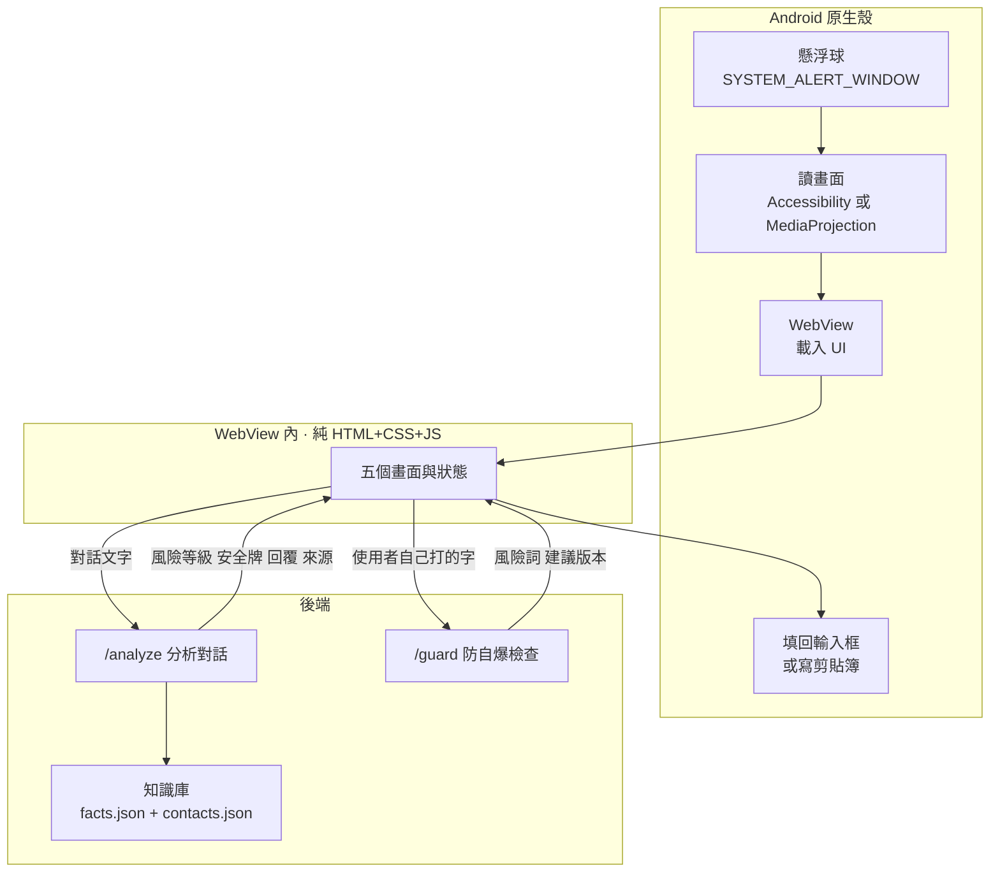

# Spec

FUTUREMODE × SITCON BUILDMODE Hackathon 2026｜賽道 Future of Work

**這份 spec 的上游是 [demo-script.md](demo-script.md)。** 功能如果沒出現在 demo 腳本裡，就不是這次的優先項。

---

## 定案

| 項目 | 決定 | 決定時間 |
|---|---|---|
| 平台 | **Android** | 2026-08-31 |
| UI 技術 | **純 HTML + CSS，跑在 WebView 裡** | 2026-08-31 |
| 知識庫 | **事實庫 ＋ 對象檔案** | 2026-08-31 |

### 為什麼是 Android 殼 + WebView

Android 原生 UI 是 Compose／XML，吃不了 HTML。如果 Zanna 畫的東西要被原生重刻一次，等於做兩次。

所以架構切成兩層：

- **Android 原生**只負責它非做不可的事：懸浮球、螢幕權限、讀畫面、填回輸入框
- **WebView 裡的 HTML** 就是產品的 UI 本體，Zanna 的產出直接是成品

副作用是 Android 那塊的範圍縮到很小，Brian 不用碰 Compose。

---

## 架構



---

## 三個機制

### 1. 分流

不是每則訊息都要動用 LLM。

| 類型 | 判斷方式 | 處理 |
|---|---|---|
| **高頻可預測**（收到、好的、我下午回你、這週三可以） | 本地規則（關鍵字／樣式比對） | 直接給一個，零延遲 |
| **要查資料**（報價多少、什麼時候出貨、規格） | 落不進本地規則的都算 | 查知識庫 ＋ LLM |

demo 不單獨演這條，但它是第一幕「0.2 秒安全牌」的來源。

### 2. 讀空氣

在產生回覆**之前**先判斷氣氛。

輸出三個等級：

| 等級 | 情境 | 策略 |
|---|---|---|
| `safe` | 一般往來 | 正常回覆 |
| `pressure` | 對方在催、在質疑、帶情緒 | **強制切換成「安撫 ＋ 給承諾」**，禁止只回「收到」 |
| `sensitive` | 涉及金額、承諾、責任歸屬 | 加上來源標註，措辭保守 |

**這是產品跟一般聊天機器人的分界線。** 一般 AI 只判斷「這句話怎麼回」，我們判斷「現在能不能這樣回」。

### 3. 防自爆

使用者不採用建議、自己動手打字時觸發。

偵測三類訊號：**防禦**（「我們跟別人不一樣」）、**推卸**（「那是他們那邊的問題」）、**火氣**（情緒詞、驚嘆號密度）。

命中就跳出潤飾建議，不強制取代。

---

## API 介面

前後端可以並行開發，靠這份契約對齊。

### `POST /analyze`

分析一段對話，回傳風險等級與建議回覆。

**Request**

```json
{
  "conversation": [
    { "speaker": "them", "text": "這個進度到底怎麼樣了？下午要跟客戶開會。", "ts": "2026-09-06T09:12:00Z" },
    { "speaker": "me", "text": "好的", "ts": "2026-09-05T18:03:00Z" }
  ],
  "contactId": "boss-lin"
}
```

**Response**

```json
{
  "risk": "pressure",
  "riskReason": "對方在催進度，且有明確時間壓力",
  "safeCard": "收到，我確認一下進度",
  "reply": "收到，我確認一下進度——今晚 8 點前補完整版給您確認。目前卡在客戶端還沒回簽，已經在追。",
  "naiveReply": "收到",
  "sources": [
    { "id": "proj-a-status", "label": "A 案進度 · 2026-09-05" }
  ],
  "latencyMs": 1840
}
```

- `safeCard` 前端在 0.2 秒內先顯示
- `reply` 到了之後**接在 safeCard 後面長出來**，不是整句抽換
- `naiveReply` 用在 demo 的對比展開（「一般 AI 會回什麼」）
- `sources` 給回覆旁邊的來源標籤用

### `POST /guard`

檢查使用者自己打的字。

**Request**

```json
{
  "draft": "我們的品質跟別人不一樣，你可以去比較看看。",
  "conversation": [{ "speaker": "them", "text": "這個價格比別家貴很多耶。" }],
  "contactId": "client-wang"
}
```

**Response**

```json
{
  "flagged": true,
  "type": "defensive",
  "reason": "帶防禦語氣，可能讓對方縮手",
  "spans": [{ "start": 0, "end": 12, "label": "防禦" }],
  "suggestion": "這個價格包含 A、B、C。如果預算有考量，我們也有 Y 方案可以談。"
}
```

`spans` 給前端做風險詞標記用。

---

## 知識庫

兩個檔案，放 repo 裡，demo 用真實資料（10–20 筆就夠）。

### `data/facts.json` — 事實庫

```json
[
  {
    "id": "quote-standard-2026",
    "label": "2026 標準報價",
    "tags": ["報價", "價格"],
    "content": "基礎方案 12 萬，含企劃、拍攝、剪輯三項。加購空拍 2 萬。",
    "updatedAt": "2026-08-01"
  },
  {
    "id": "proj-a-status",
    "label": "A 案進度",
    "tags": ["進度", "A案"],
    "content": "卡在客戶端還沒回簽合約，已於 9/4 追過一次。",
    "updatedAt": "2026-09-05"
  }
]
```

### `data/contacts.json` — 對象檔案

```json
[
  {
    "id": "boss-lin",
    "name": "林經理",
    "role": "主管",
    "tone": "簡潔、先講結論、要具體時間",
    "notes": "在意時程超過在意細節。回覆一定要給明確的時間點。",
    "recentTopics": ["A 案進度", "Q4 預算"]
  },
  {
    "id": "client-wang",
    "name": "王先生",
    "role": "客戶",
    "tone": "禮貌、給選項、不要壓迫",
    "notes": "價格敏感，比較過三家。",
    "recentTopics": ["報價", "交期"]
  }
]
```

**檢索方式**：資料量小，48 小時內不做向量檢索。直接把相關的幾筆塞進 context，靠 tag 與關鍵字粗篩即可。

---

## 五個畫面

詳細狀態見 [demo-script.md](demo-script.md)。這裡列前端要實作的部分。

| # | 畫面 | 前端要做的事 |
|---|---|---|
| 1 | 待命 | 收起／hover 兩個狀態 |
| 2 | **讀空氣＋回覆生成** ⭐ | safeCard 先顯示 → reply 接續長出來的動畫；風險標記；來源標籤；對比展開 |
| 3 | **防自爆攔截** ⭐ | 輸入區；打字時呼叫 `/guard`（debounce，指延遲觸發避免每個字都送）；攔截卡滑入；`spans` 標記 |
| 4 | 跨 App | 動畫或預錄，不用真做 |
| 5 | 知識庫設定 | 靜態一張，被問到才開 |

**視覺火力集中在 2 和 3。**

---

## 分工（依模組，不依畫面）

| 模組 | 內容 |
|---|---|
| **Android 殼** | 懸浮球權限、讀畫面、WebView 容器、JS bridge、填回輸入框 |
| **前端 UI** | 五個畫面與所有狀態，純 HTML+CSS+JS |
| **後端** | `/analyze`、`/guard`、知識庫檢索、分流規則 |
| **內容與測資** | facts.json、contacts.json 的真實資料；demo 對話腳本；備援錄影 |

**動態轉換要有人明確負責。** 這個 demo 的價值在「文字長出來」「卡片滑進來」，不在靜態版面。如果沒人負責狀態轉換，會做出漂亮但不會動的畫面。

---

## 待確認

### 技術（Brian）

- [ ] **讀畫面用 Accessibility Service 還是 MediaProjection？**
  - Accessibility：直接拿到文字節點，準、快、省 token，不需要 VLM
  - MediaProjection：拿到截圖，要過 VLM，慢且貴，但「截圖」的敘事比較好講
  - 建議先試 Accessibility，敘事上一樣可以說「它看得到螢幕上的對話」，而且技術上更硬
- [ ] 填回輸入框用 Accessibility 的 `ACTION_SET_TEXT` 還是寫剪貼簿？剪貼簿最穩，但多一步

### 賽務（Zeno）

- [ ] 問主辦：demo 幾分鐘、要交什麼、Round 1 是走攤還是上台、**賽前寫好的 codebase 能不能用**
- [ ] ElevenLabs 額度登記，需要每位隊員姓名與 email

### 視覺（Zanna）

- [ ] 設計語言的底從哪裡來。**不要用 AI 生成的設計系統當底**，要從真的出貨過的產品拆。Raycast 形態最接近（浮層、呼叫出來、做完消失）

---

## 明確不做

- 不做 iOS
- 不做語音輸入
- 不做自動送出，永遠停在使用者眼前等他點
- 不串任何平台 API
- 不做向量檢索
- 不做「對話溫度追蹤」（讀空氣是它的即時版，範圍更小、demo 更好演）
